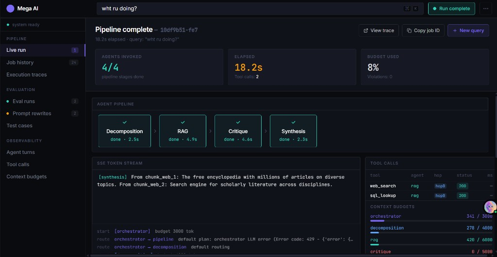
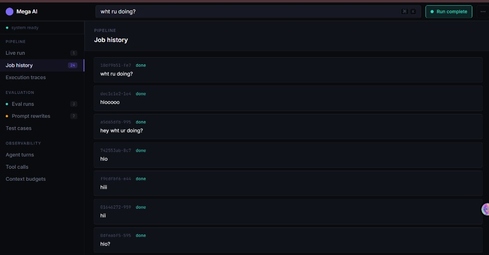
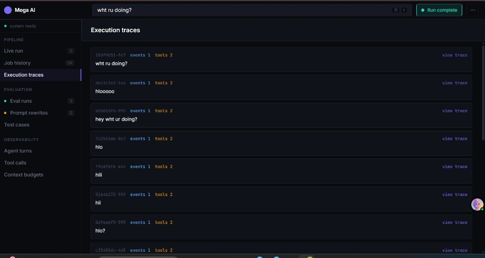
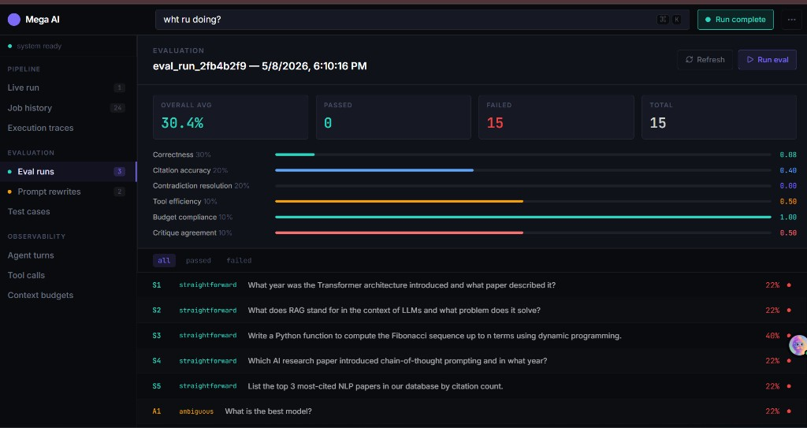

# NEUROSTACK AI

**Real-time multi-agent LLM orchestration and evaluation** — a containerized system with dynamic routing, SSE streaming, tool calling with retries, a custom 15-case eval harness, and a self-improving prompt loop (human-in-the-loop approvals).

---

## Screenshots

### Live run (pipeline, SSE stream, tool calls, budgets)



### Job history



### Execution traces (summaries with event / tool counts)



### Evaluation runs (15 cases, multi-dimensional scores)



---

## What’s working

| Area | Status |
|------|--------|
| **Live pipeline** | Submit a query → SSE stream with tokens, routing, tool calls, budgets, `done` / errors handled |
| **Agents** | Orchestrator, decomposition, RAG, critique, synthesis; shared context; dynamic plans (e.g. skip decomposition for short queries) |
| **Tools** | `web_search` (stub index), `sql_lookup` (NL→SQL + in-memory rows, heuristic fallback), `code_executor`, `self_reflection` |
| **Job persistence** | PostgreSQL: jobs, tool call logs, eval results, prompt versions |
| **Dashboard** | React UI: live run, **job history** (`GET /api/jobs`), **execution traces** (`GET /api/traces`), job detail (`GET /api/trace/{id}`), eval, prompts, test cases, observability pages |
| **Docker** | `docker compose up --build` — API, worker, Postgres, frontend (nginx), Adminer; **`GET /health`** for container health (not part of the core `/api` contract) |
| **Evaluation** | 15 cases (5 straightforward / 5 ambiguous / 5 adversarial), custom scorer, results stored in DB |
| **Prompt loop** | Pending rewrites, approve/reject endpoint, re-eval failed cases |
| **Strict API mode** | `STRICT_API_FIVE_ENDPOINTS` — core assignment routes + dashboard list endpoints; set `false` for extra debug routes (`/api/eval/rerun`, `/api/agent-turns`, etc.) |

---

## Architecture

```
┌─────────────────────────────────────────┐
│  CLIENT (Browser)                        │
│  SSE ◄────────────────────────► Frontend │
│  REST ◄────────────────────────► API     │
└─────────────────────────────────────────┘
                    │
                    ▼
              ┌───────────────────────────┐
              │  API Server (FastAPI)      │
              │  + Background Worker       │
              └─────────────┬─────────────┘
                            │
              ┌─────────────▼─────────────┐
              │  PostgreSQL                │
              │  jobs, events, eval,       │
              │  tool logs, prompts         │
              └─────────────┬─────────────┘
                            │
              ┌─────────────▼─────────────┐
              │  Orchestrator → agents     │
              │  (shared context only)     │
              └───────────────────────────┘
```

**Agents:** orchestrator (routing + budgets) → decomposition, RAG, critique, synthesis (order decided at runtime). **Compression** can run when context nears budget limits.

---

## Tech stack

- **Backend:** Python 3.11, FastAPI, Uvicorn, SQLAlchemy (async), PostgreSQL (`asyncpg`)
- **Frontend:** React, Vite, TanStack Query, Wouter
- **Infra:** Docker Compose, nginx (static dashboard), optional Adminer on port 8081

---

## Quick start

```bash
git clone https://github.com/anushree1206/mega-ai.git
cd mega-ai

# Environment (do not commit real keys)
cp .env.example .env   # if present; otherwise create .env — see below

docker compose up --build
```

| Service | URL |
|---------|-----|
| API | http://localhost:8000 |
| Frontend | http://localhost:3000 |
| Adminer (DB UI) | http://localhost:8081 |

**Minimum `.env` (example names — use your provider’s variables):**

- `OPENAI_API_KEY` or `AI_INTEGRATIONS_OPENAI_API_KEY`
- Optional: `OPENAI_BASE_URL` / `AI_INTEGRATIONS_OPENAI_BASE_URL`
- Optional: `OPENAI_MODEL`, `ORCHESTRATOR_MODEL`, `AGENT_MODEL` (defaults may hit rate limits on some tiers)
- `STRICT_API_FIVE_ENDPOINTS` — default `true`; set `false` for dev-only routes

---

## API (core contract)

| Method | Path | Description |
|--------|------|-------------|
| `POST` | `/api/query` | Submit query → **SSE** stream (`job_created`, `token`, `routing`, `tool_call`, `budget`, `agent_*`, `done`, `error`) |
| `GET` | `/api/trace/{job_id}` | Full trace: query, status, final answer, provenance, events, tool calls |
| `GET` | `/api/eval/latest` | Latest eval run summary + per-case scores |
| `POST` | `/api/prompts/{id}/review` | Body: `{ "action": "approve" \| "reject" }` |
| `POST` | `/api/eval/re-eval` | Re-run eval on failed cases from latest run |

**Dashboard helpers (enabled even in strict mode):**

- `GET /api/jobs` — recent jobs list  
- `GET /api/traces` — trace summaries (event/tool counts)  

**Liveness:** `GET /health` (for Docker healthchecks)

With `STRICT_API_FIVE_ENDPOINTS=false`, additional routes include `/api/eval/rerun`, `/api/jobs/{id}` (alias), `/api/agent-turns`, `/api/tool-calls`, `/api/budgets`, `/api/prompts`, etc.

Errors return JSON: `{ "detail": { "error_code", "message", "job_id"? } }`.

---

## Evaluation

- **15 cases** in `backend/eval/cases.py` — straightforward, ambiguous, adversarial  
- **Custom scoring** in `backend/eval/scorer.py` — correctness, citations, contradiction resolution, tool efficiency, budget compliance, critique agreement (each with numeric score + justification)  
- Trigger full run via **`POST /api/eval/rerun`** when strict mode is off, or wire your own call in dev  

---

## Known limitations

- RAG **web_search** uses a **stub** index; **sql_lookup** uses **sample in-memory** data (not production Postgres RAG).  
- Heavy **eval** runs many LLM calls; use a model tier that avoids **429** rate limits.  
- **Execution event** count per job may be low if only routing snapshots are persisted — tool rows still populate from `tool_call_logs`.  
- Vector DB / real web search are **not** included (see “What I would build next” in code comments / future work).

---

## AI collaboration

This project was developed with AI coding assistance. Architecture, agent boundaries, eval design, and security considerations were reviewed by the author; generated code was validated against the stated requirements.

---

## License

Use and modify per your needs for the take-home / portfolio context.
